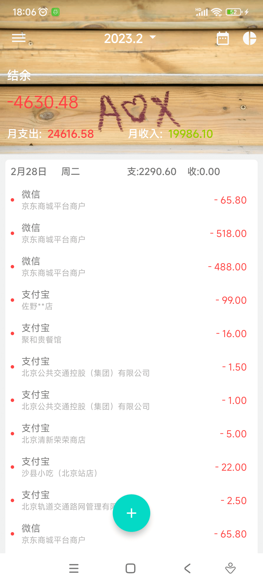
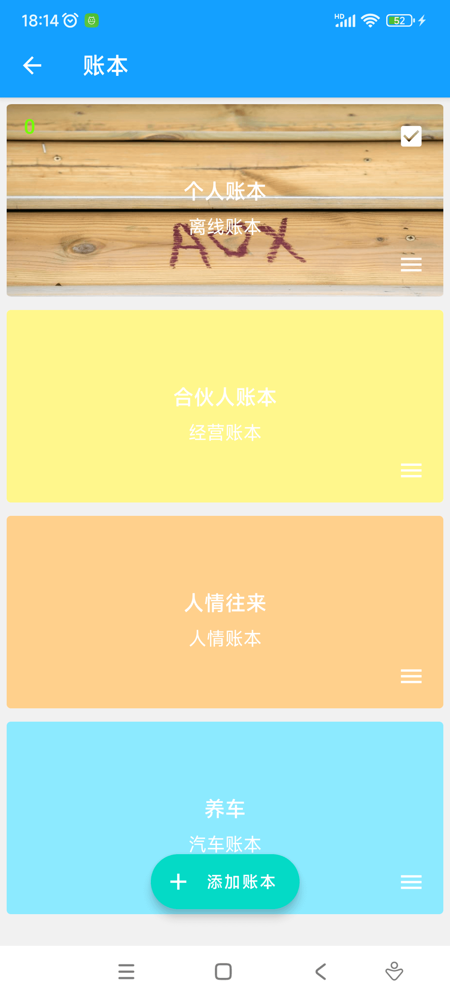
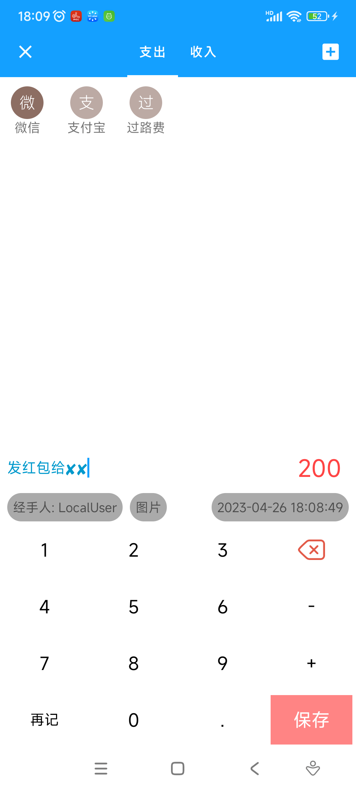
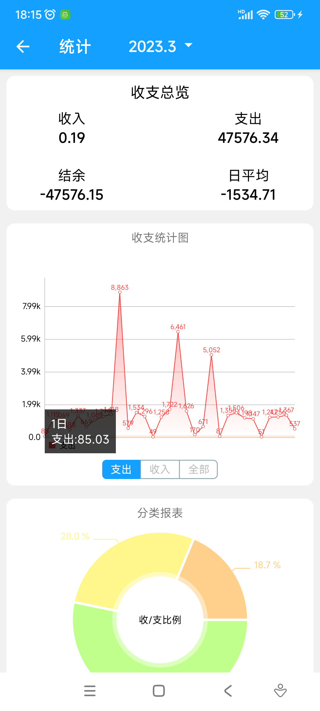
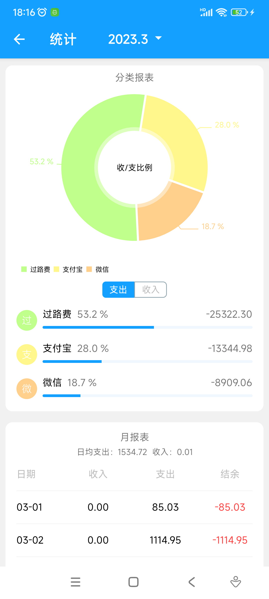
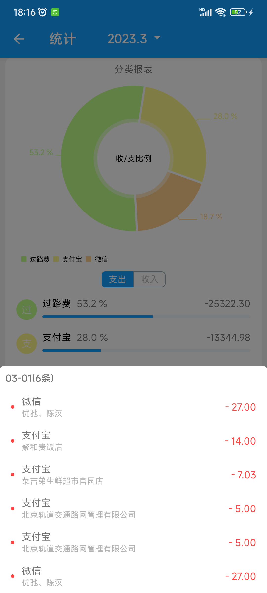
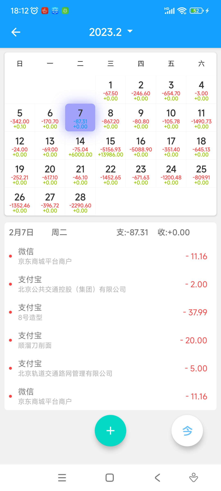
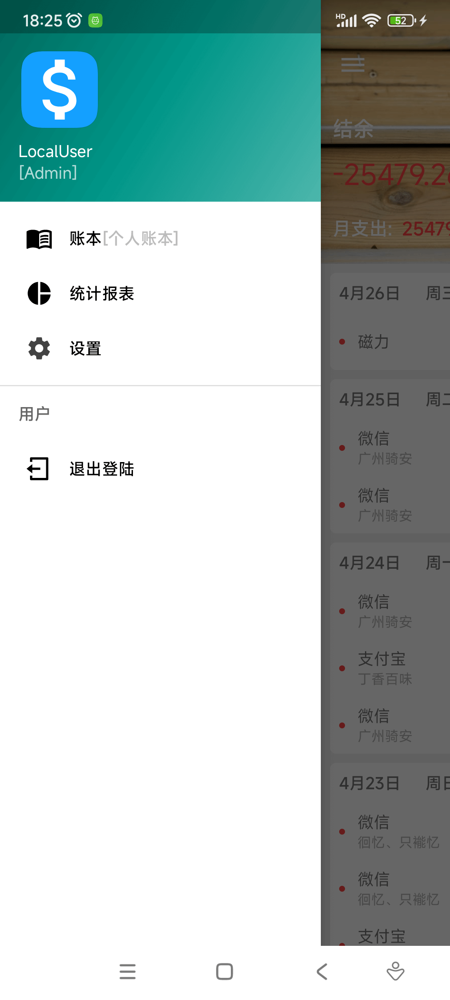

# 合記
> 注：该项目为练手项目仅仅用做学习和非商业化目的，包含了前后端，UI方面参考了钱迹（无广告且记账速度非常快的一款记账软件），我本身也是钱迹的超级终身VIP，非常感谢钱迹的优秀开发者。

## 功能介绍

多人同时记账,账单区分权限,账单统计,账单导入,账单导出，账单同步
> 后端同步服务 https://github.com/RUANHAOANDROID/heji-server
### UI
> 账本封面拍摄于2018hetian玉泉湖公园的木阶梯,基本功能完善后添加账本封面自定义功能。

<table>
    <tr>
      <td>
                 
      </td>
      <td>
          
      </td>
      <td>
          
      </td>
    </tr>
    <tr>
        <td></td>
        <td> </td>
        <td></td>
    </tr>
        <tr>
        <td></td>
        <td> </td>
        <td></td>
    </tr>
</table>

### 权限角色
不同角色具有不同的权限

* 管理员(待开发)
  
   > 管理员具有创建管理用户权限
* 账本创建人（待开发）
  
   > 账本创建人具有账本全权
* 账本用户
  
   >账本用户可以添加账单\修改自己添加的账单\删除自己添加的账单权限
* 查账人（待开发）
  
   > 查账人仅可以浏览账本

### 账本

#### 功能描述：
1. 用户均可创建账本,账本通过口令分享给其他记账人.仅创建人具有删除账本权限且账本不再有账单.
2. 账本创建人具备分配账本权限功能{浏览\增加\更改\删除}
3. 账本具备{账本名称\账本所属类别}
4. 账单有金额、时间、票据、记账人、经手人、类别等属性

#### 账单
1. 账单分为收入\支出
  
2. 账单属性

   > 账单类别|金额|时间|票据图片|备注信息

3. 账单查重功能

   > 通过账单时间\金额\票据MD5值判断是否存在重复记录

4. 账单导入

   >  导入支持 支付宝、微信、ETC 、EXCEL、CVS、钱迹 

5. 账单导出

   > 导出支持 EXCEL、CVS、钱迹
   >
6. 多人记账用户仅能删除或修改自身账单

#### 统计
1. 支出人员支出占比
   * 起始资金占比
   * 月支出占比
   * 年支出占比
   
    > 根据时间分为月/年/有史以来
2. 支出走势
   * 不同类别支出走势图
3. 收支类型占比
   * 全年收支占比
   * 月收支占比
4. 报表
   * 全年收支报表
   * 月收支报表
5. 收支总览
   * 年收支总揽
   * 月收支总揽

## Client Android

Android client 采用单Activity 多Fragment的MVI模式

### 技术栈
*   基于AndroidX,使用Java + kotlin 混合开发
*   OkHttp + retrofit 网络请求
*   navigation Fragment导航
*   BaseRecyclerViewAdapterHelper 列表的展示
*   moshi 数据格式化
*   MatisseKotlin 图片选择
*   permissionx 人性化的权限封装
*   room 更简单好调试的Sqlite数据库
*   utilcode 强大简单的工具集
*   xpopup 多样式的弹窗
*   Luban 账单图片压缩
*   calendarview 日历账单视图与记账
*   datastore  少量数据的本地存储
*   MPAndroidChart 强大的图表用做统计
*   immersionbar 多机型Toobar的封装适配

## 服务端
> 打算迁移到golang and proto3，为方便更多的低功耗设备或家庭服务器使用

服务端使用Java Springboot框架，数据库采用MongoDB
### 数据集设计
> 数据库使用MongoDB。一开始服务端数据库使用MySQL，随着业务变更MySQL调整起来非常不便，MongoDB能够快速适应业务的调整，存储票据图片（客户端有压缩）迁移和管理也非常方便。
#### 用户（MUser）
列名| 类型| 说 明 
------------ | :-----------:|:----------: 
_id | ObjectID| 自增ID 
name | String | 用户名 
password | String | 密码 
tel | String | 电话号码 
authority | List<MAuthority> | 权限（关联权限集） 

#### 权限（MAuthority） 
列名| 类型| 说 明 
:----------- | :-----------:|:----------: 
_id| ObjectID | 自增ID 
authority| String | 权限 
book_id| String | 账本ID（关联账本集） 

#### 账本（MBook）
列名| 类型| 说 明 
:----------- | :-----------:|:----------: 
_id| ObjectID | 自增ID 
book_name| String | 账本名称 
createUser| String | 创建人 
cover| byte[] | 封面图片 

#### 账单（MBill）

列名| 类型| 说 明 
:----------- | :-----------:|:----------: 
_id| ObjectID | 自增ID 
book_id| String | 所属账本ID 
money| Double | 货币 
category| String | 账单收支类型 
type| Integer | 收入/支出 
dealer| String | 经手人 
createUser| String | 创建人 
remark| String | 备注 
images| String[] | 图片集（关联账单图片） 
time| String | 账单日期（用户选择的日期） 
create_time| long | 创建时间 
update_time| long | 更新时间 

#### 账单备份（MBillBackup）

> 同账单

#### 账单票据图片（MBillImage）
列名| 类型| 说 明 
------------ | :-----------:|:----------: 
_id| ObjectID | 自增ID 
bill_id| String | 所属账单ID 
filename| String | 文件名 
length| Long | 文件长度 
md5| String | MD5 
upload_time| Long | 上传时间 
ext| String | 后缀名 
isGridFS| Boolean | 是否分片 
data| Binary | 二进制图片 

#### 账单类型（MCategory）
列名| 类型| 说 明 
------------ | :-----------:|:----------: 
_id| ObjectID | 自增ID 
book_id| String | 所属账本ID 
type| Integer | 支出/收入 
name| String | 标签名 
level| Integer | 多级标签所属等级 
index| Integer | 排序顺序 

#### 同步日志（MOperateLog）
列名| 类型| 说 明 
------------ | :-----------:|:----------: 
_id| ObjectID | 自增ID 
book_id| String | 根据book划分日志
opeID| Integer | 操作对象的ID
opeClass| String | 操作对象类别 （操作了账本或账单）
opeType| Integer | 操作类型（删除或更新）
opeDate| String | 操作时间（客户端操作时间） 

#### 客户端错误日志（MErrorLog）
列名| 类型| 说 明 
------------ | :-----------:|:----------: 
_id| ObjectID | 自增ID 
deviceModel| String | 设备型号 
tel| String | 电话号 
contents| String | 日志内容 

待补充...

### 技术栈
*   SpringBoot 基础框架
*   MongoDB 数据存储
*   JWT  Json web Token 用户鉴权
*   gson  数据的格式化
*   Easyexcel Excel导入导出操作
*   Lombok 减少样板代码
  
## 感谢 JetBrains 免费的开源授权

