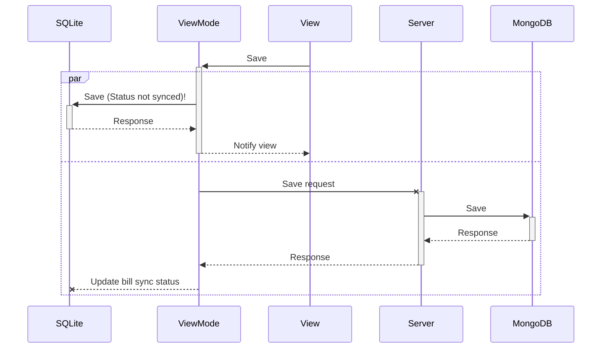

### Save bill

```mermaid

sequenceDiagram
	 participant SQLite
	 participant ViewMode
	 participant View
	 participant Server
	 participant MongoDB

    View->> + ViewMode: Save
    par
      ViewMode->> + SQLite: Save (Status not synced)!
      SQLite-->> - ViewMode: Response
      ViewMode-->> - View:Notify view
    and
    	ViewMode-x + Server: Save request
    	Server->> + MongoDB:Save
    	MongoDB-->> - 	Server:Response
    	Server-->> - ViewMode:Response
    	ViewMode --x SQLite:Update bill sync status
    end
```