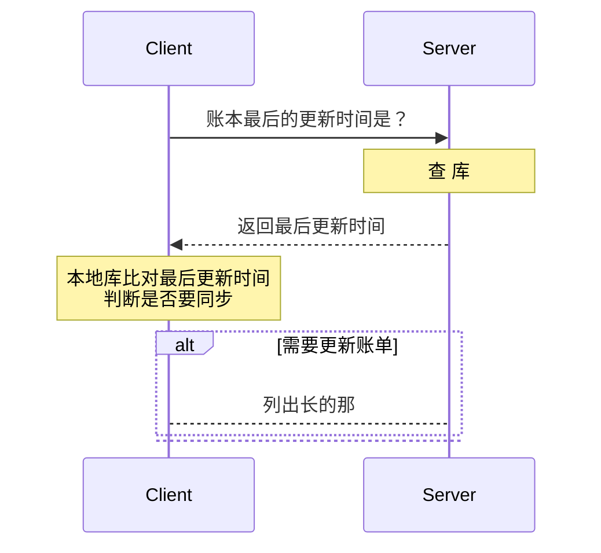
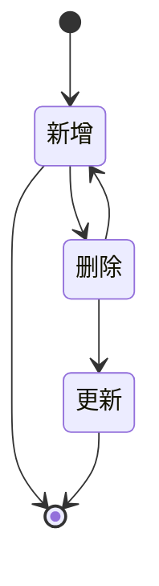

# 客户端与服务端的数据同步

## 本地优先

本地Token存在的情况下，在无网络下可以创建账本、账单、待连接网络后与服务器数据库同步

## 同步方案

同步主要针对账本（一切围绕账本）账单。

1.客户端采用object id 保证数据的唯一性

2.客户端

```mermaid
sequenceDiagram
    participant Client
    participant Server
    Client->>Server: 账本最后的更新时间是？
	Note over Server :   查 库
	Server-->> Client :返回最后更新时间
	Note over Client:本地库比对最后更新时间<br>判断是否要同步
	alt 需要更新账单
		Client -->Server:列出长的那	
	else
	end 
```

``` mermaid
stateDiagram-v2
    [*] --> 新增
    新增 --> [*]
    新增 --> 删除
    删除 --> 新增
    删除 --> 更新
    更新 --> [*]
```
