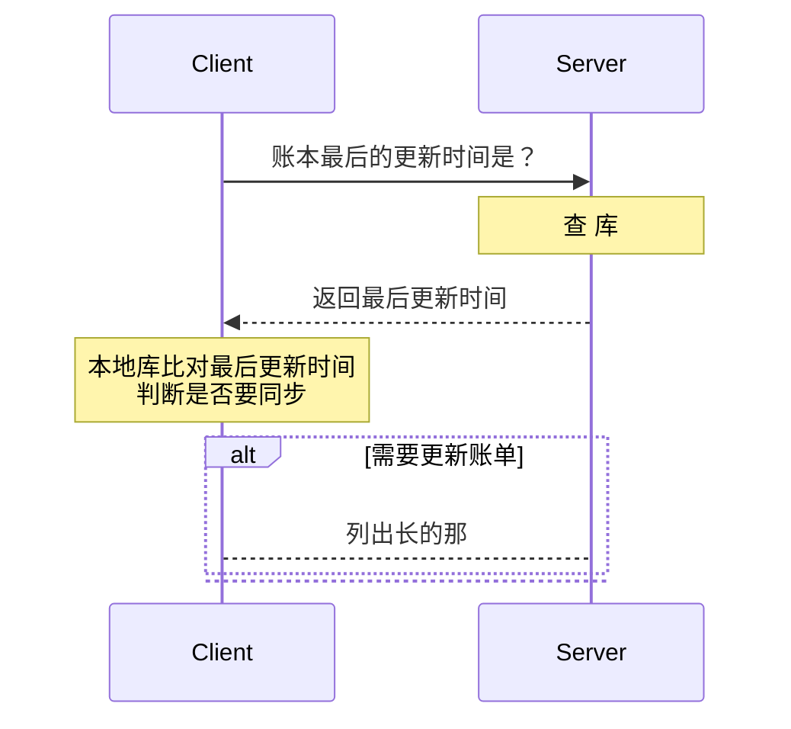

```mermaid
sequenceDiagram
    participant Client
    participant Server
    Client->>Server: 账本最后的更新时间是？
	Note over Server :   查 库
	Server-->> Client :返回最后更新时间
	Note over Client:本地库比对最后更新时间<br>判断是否要同步
	alt 需要更新账单
		Client -->Server:列出长的那	
	else
	end 
```